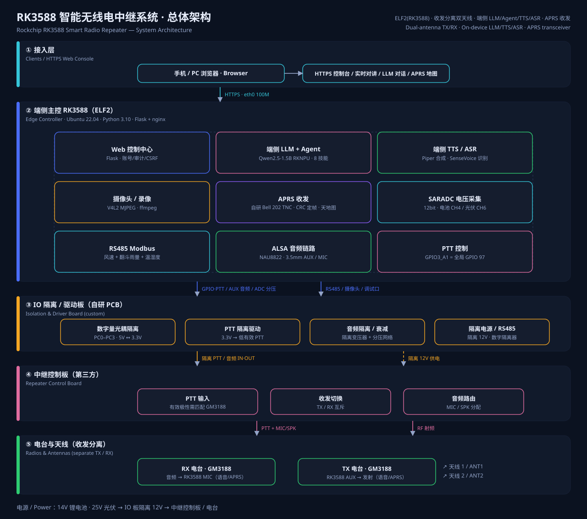

<div align="center">

# RK3588 智能无线电中继系统
### Rockchip RK3588 Smart Radio Repeater

**端侧 AI · 全隔离 IO · 收发分离双天线中继**
**On-device AI · Fully Isolated IO · Separated TX/RX Dual-antenna Repeater**



`RK3588 / ELF2` · `Ubuntu 22.04` · `Flask + nginx` · `RKNPU LLM` · `Piper TTS` · `Modbus RTU` · `GPIO PTT`

</div>

---

## 1. 项目简介 / Overview

本项目中继台由 **瑞芯微 RK3588（ELF2 开发板）** 作为端侧主控，配合两块自研小板
（**IO 隔离/驱动板**、**ADC 分压采集板**）、一块**第三方中继控制板**与
**两台 Motorola GM3188 电台（收发分离、双天线、无需双工器）** 组成。
RK3588 负责全部"智能"部分：网页控制台、端侧大模型（LLM）与 Agent 技能、
端侧语音合成（TTS）、音频采集与转发、PTT 时序控制、电压/气象遥测、摄像头与录像。

> **EN** — An RK3588 (ELF2) edge controller drives a custom **IO isolation/driver board**,
> an **ADC divider board**, a third-party **repeater control board**, and **two Motorola GM3188
> radios (separate TX/RX with two antennas, no duplexer)**. The RK3588 hosts the whole
> intelligence stack: web console, on-device LLM + agent skills, on-device TTS, audio
> capture/forwarding, PTT timing, telemetry (battery/PV voltage, wind, rain) and camera.

设计目标 / Goals：

| 目标 Goal | 说明 Description |
|---|---|
| 端侧自治 Offline-first | LLM/TTS 全本地推理，无外网依赖（LLM 走 RKNPU，TTS 走 Piper） |
| 电气安全 Isolation | 数字量/PTT/音频/电源/RS485 全隔离，避免电台侧干扰与地环流 |
| 语音可懂 Readable voice | 中英混读 + ICAO 字母解释法（呼号/航班号广播） |
| 可运维 Operable | 网页控制台 + 审计日志 + GPIO 自检 + 运行状态遥测 |

---

## 2. 系统架构 / System Architecture


### 分层说明 / Layers

| 层 Layer | 组成 Components | 职责 Responsibility |
|---|---|---|
| ① 接入层 Clients | 手机/PC 浏览器 | HTTPS 控制台、实时对讲、LLM 对话 |
| ② 端侧主控 Edge | RK3588（ELF2）+ Flask/nginx | 业务逻辑、AI 推理、IO 与遥测 |
| ③ 隔离驱动 Isolation | 自研 IO 隔离/驱动板 | 光耦隔离 PC0–PC3、PTT 隔离驱动、音频隔离衰减、隔离 12V/RS485 |
| ④ 中继控制 Controller | 第三方控制板 | PTT 输入、收发互斥切换、音频路由 |
| ⑤ 电台天线 Radios | 2× GM3188 + 双天线 | 接收（→RK3588 MIC）/ 发射（RK3588 AUX→） |

### 关键数据流 / Data flow

- **接收链 RX**：天线 → RX 电台 → 控制板音频 → 隔离衰减 → RK3588 MIC → 网页实时播放 / 转写
- **发射链 TX**：LLM 回复或网页语音 → 端侧 TTS → 3.5mm AUX → 隔离 → 控制板 → TX 电台（**PTT 同步拉高**）
- **控制链 Control**：RK3588 `GPIO3_A1`（全局 GPIO 97）→ 隔离驱动 → 控制板 PTT（GM3188 为**低有效**）
- **遥测链 Telemetry**：电池/光伏分压 → SARADC；风速/雨量 → RS485 Modbus RTU
- **链路 Link**：eth0 强制 100 Mbps/Full（禁用自协商以规避链路抖动）

---

## 3. 功能特性 / Features

| 模块 Module | 能力 Capability | 状态 |
|---|---|---|
| **端侧 LLM** | RKNPU Qwen2.5-1.5B（W8A8），OpenAI 兼容 `/v1/chat/completions`，SSE 流式 | ✅ |
| **Agent 技能** | 8 个技能/工具调用（气象、雨量、电压、系统、电台、摄像头、时间、语音播报） | ✅ |
| **速率监测** | 实时 TTFT / tok·s⁻¹ / tokens；历史统计入库与图表 | ✅ |
| **提示词注入** | 系统提示词 + 实时变量 `{battery} {pv} {cpu_temp} {wind} …` | ✅ |
| **端侧 TTS** | Piper 中/英/ICAO 混读、音色包上传/删除、流式分句朗读 | ✅ |
| **端侧 ASR** | sherpa-onnx + SenseVoice int8（中英日韩粤），离线语音转文字，**RTF≈0.05（约 20× 实时）** | ✅ |
| **网页对讲** | 麦克风 → 板端 AUX（按住说话，自动 PTT，看门狗释放） | ✅ |
| **PTT 控制** | 引用计数、0.8 s 桥接、最短压发防抖、手动发射自检、事件追踪 | ✅ |
| **电压遥测** | SARADC 12 bit 双路分压（电池/光伏）+ 零点/倍率校准 | ✅ |
| **气象雨量** | RS485 Modbus：风速变送器 + 翻斗式雨量计 + **温湿度变送器（从站 03）**，小时/日统计 | ✅ |
| **摄像头** | V4L2 MJPEG 采集、**开机自动循环录像（掉线自愈）**、单次录像、回放/时间轴、容量清理、OSD/RTMP；实时预览与回放合并为同一控制台（模式切换） | ✅ |
| **BUSY 检测** | **GPIO3_A5（全局 GPIO 101）光耦输入**，总览实时显示接收状态、发射期自激告警、极性与电平沿诊断 | ✅ |
| **Web 控制台** | 账号/角色、CSRF、审计日志、HTTPS 反向代理、系统监控 | ✅ |
| **硬件板卡** | IO 隔离/驱动板、ADC 分压采集板 | 🔶 原理图完成，PCB 联调中 |

> **EN** — Feature set: on-device LLM (RKNPU Qwen2.5-1.5B) with **agent skills + prompt injection +
> real-time token-rate metrics**; on-device **Piper TTS** (zh/en/ICAO) with streaming read-out;
> **web intercom** (hold-to-talk with auto-PTT); **PTT state machine** (refcount, debounce,
> manual self-test, event tracing); **dual-channel SARADC** voltage telemetry with calibration;
> **RS485 Modbus** wind, rain and a **temperature/humidity transmitter**; **V4L2 camera** with
> **auto-start loop recording (self-healing)** and a merged preview/playback console; a
> **BUSY input on GPIO3_A5** mirrored live in the overview; secured **web console**.

---

## 4. 项目结构 / Repository Layout

```text
RockchipRK3588-Smart-Repeator/
├── README.md                     本文件（中英双语） / this bilingual README
├── LICENSE                       GPL-3.0
├── assets/
│   ├── architecture.svg          系统架构图 / system architecture (SVG)
│   ├── make_architecture_svg.py  架构图生成脚本 / diagram generator
│   ├── check_layout.py           SVG 版式自检 / layout self-check
│   ├── ELF2_40P20P_接线核对图.svg  接口接线核对图 / pinout check
│   └── legacy-系统架构.svg        早期架构草图 / early draft
├── board/                        ★ 板端软件（部署到 /www） / on-device software
│   ├── app.py                    Flask 主程序（路由/鉴权/PTT/遥测/API）
│   ├── agent_service.py          端侧 Agent：技能注册、提示词、工具解析、速率统计
│   ├── tts_service.py            Piper 合成 + 中英/ICAO 分段 + 音色包管理
│   ├── weather_service.py        RS485 Modbus 采集（风速/雨量）+ SQLite 存储
│   ├── camera_service.py         V4L2 采集 + ffmpeg 录像/推流
│   ├── postfilter.py             TTS 音频后处理（响度/滤波）
│   ├── templates/ static/        Web 前端（原生 JS + SSE + 轮询）
│   ├── deploy/                   systemd / nginx / udev / GPIO 部署脚本
│   ├── tests/                    PTT 与流式朗读自动验证脚本
│   ├── requirements.txt          Flask 2.2.2 / Werkzeug 2.2.2 / requests
│   └── README.md                 板端软件详细说明（API、踩坑、调参）
├── hardware/                     硬件设计 / hardware design
│   ├── README.md                 隔离板 + 分压板设计说明与验算
│   ├── eda_scripts/              嘉立创 EDA 自动化脚本（CDP 驱动建板/布线）
│   ├── BOM_Board1_Schematic1_*.xlsx   BOM
│   └── ELF2_P26_P28_schematic.png    P26/P28 排针原理图
├── tools/                        外围调试脚本 / bring-up tools
│   ├── scan_modbus.py raw_modbus.py probe_modbus_registers.py
│   ├── debug_rs485.py test_modbus.py scan_modbus2.py
│   └── make_elf2_wiring_svg.py
└── docs/                         设计与部署文档 / design & deployment notes
    ├── 多模态端侧智能无线电中继系统架构.md
    ├── 部署记录-2026-09-09-端侧LLM.md … 部署记录-2026-09-13-PTT-GPIO.md
    ├── 端侧TTS选型与音色训练方案.md / 板端TTS后处理接入说明.md
    ├── ELF240P20P管脚功能分配和硬件连线.md
    └── 3.5mm耳机接口音频输入原理图结论.md
```

> **EN** — `board/` = on-device application (deploy to `/www`); `hardware/` = custom board docs +
> EDA automation + BOM; `tools/` = bring-up scripts; `docs/` = design & deployment notes;
> `assets/` = architecture diagram (SVG) and its generator.

---

## 5. 实现方式 / Implementation

### 5.1 端侧 LLM 与 Agent 技能 / On-device LLM & Agent

- **推理服务**：`rkllm-server` 暴露 OpenAI 兼容接口（`127.0.0.1:8001/v1`），
  模型 Qwen2.5-1.5B（RKNPU W8A8）；实测 **首字 0.9 s、13~24 tok/s**。
- **流式**：Flask 侧 `requests(stream=True)` 转发 SSE，同时逐帧统计 tokens 与 TTFT。
- **Agent 循环**：把技能清单写进提示词，模型输出一行纯文本协议

  ```
  READ get_power {}
  ```

  后台解析 → 执行技能 → 结果回灌 → 模型用自然语言总结（最多 5 轮）。
- **技能集**：`get_weather` `get_rain` `get_power` `get_system` `get_radio` `get_camera` `get_time` `speak`。
- **工程细节**（板端模型的三个坑，详见第 10 节）：指令并入用户消息、避开 `<tool_call>`
  特殊 token、提示词压到 ~350 字、工具名别名归一。

> **EN** — The RKLLM server exposes an OpenAI-compatible API. The agent uses a plain-text
> `READ <tool> {}` protocol (Qwen's `<tool_call>` token is dropped by the server), maps
> model-invented tool names via an alias/keyword resolver, and loops up to 5 rounds while
> streaming tool/usage events to the browser.

### 5.2 端侧 TTS 与流式朗读 / On-device TTS

- Piper（板端为 2023 版 C++ 构建，`/opt/ai/piper`，音色 `/opt/ai/voices/<id>/model.onnx`）。
- **中英混读**：按语言分段 → 中文用 `Rosmontis_v2`、英文用 `Rosmontis_en`、
  **ICAO 呼号/字母解释法**用 `en_US-lessac-medium`（可读性最佳）→ 拼接为一段音频。
- **流式朗读**：LLM 增量按句切分 → 逐段合成 → 逐段播放（RTF≈0.11~0.13），
  整条回复期间 **PTT 保持使能**（会话级引用计数）。

> **EN** — Piper runs locally; text is split by language (zh / en / ICAO spelling) and rendered
> with the best-matching voice, then streamed sentence-by-sentence to the 3.5 mm AUX output while
> PTT is held for the whole reply.

### 5.3 PTT 控制状态机 / PTT state machine

```
_ptt_retain()  ──► HOLD_COUNT+1 ──(0→1)──► GPIO=1
_ptt_release() ──► HOLD_COUNT-1 ──(→0)───► 0.8s 定时 ──► 最短压发校验 ──► GPIO=0
```

- 引用计数支持"音频 + 网页对讲 + 手动自检"并发；0.8 s 释放延时桥接流式 TTS 分片间隙。
- **最短压发**（`RELAY_PTT_MIN_HOLD`，默认 1 s）抑制继电器亚秒级反复 key。
- **看门狗**：流式会话空闲 / 对讲 8 s 无数据 / 手动发射 8 s 无心跳 → 强制释放。
- **事件追踪**：每次拉高/拉低记录「动作 + 原因 + 调用者 + 引用计数」，页面直接可见。
- **AT 侧极性**：GM3188 PTT 为**低有效**；隔离板必须匹配该极性（必要时反相）。

> **EN** — A refcounted PTT state machine: first retain pulls the GPIO high; the last release
> waits 0.8 s (bridging segment gaps), enforces a minimum key-up time (default 1 s, anti-chatter),
> and can be forced low by watchdogs (idle stream / stalled intercom / missing heartbeat).

### 5.4 遥测：SARADC 与 Modbus / Telemetry

- **SARADC**：12 bit、0–1.8 V（`0.43945 mV/LSB`），通过 sysfs IIO 读取
  `in_voltage{4,6}_raw`；分压网络 → 倍率校准（电池 **10.11 V/V**、光伏 **17.01 V/V**）。
- **Modbus RTU**：`/dev/ttyS9` 9600 8N1，站号 1（风速）、23（雨量）、**03（温湿度）**，
  自实现 CRC16 与帧解析，数据入 SQLite 供图表与统计。
- **温湿度变送器**（从站 03）：功能码 04 读输入寄存器，起始寄存器 = 温度 `int16`（有符号）、
  下一个 = 湿度 `uint16`，默认倍率 0.1（→ °C / %RH），倍率与温度偏移均可在页面调整；
  采集按日写入 `th_YYYY-MM-DD.csv` 并同步 SQLite。**传感器暂未接线**，启用后读取会返回
  Modbus 超时，属预期现象（风速已 `采集正常`，说明总线与 TTL-RS485 链路可用）。

> **EN** — Battery/PV rails are scaled by resistor dividers into the RK3588 12-bit SARADC
> (0–1.8 V); voltage = ADC pin voltage × calibrated multiplier. Wind, rain and
> temperature/humidity sensors are polled over RS485 Modbus RTU (slaves 1 / 23 / 03) with a
> hand-rolled CRC16 stack; samples are stored in SQLite and per-day CSV.

### 5.5 音视频 / Audio & Video

- **音频**：ALSA `plughw:CARD=rockchipnau8822,DEV=0`（NAU8822 codec）；
  TTS/对讲走 `aplay`，采集走 `arecord`；全局音量与静音由 `amixer` 控制。
- **视频**：V4L2 MJPEG 采集 → ffmpeg 转封装为分段 MP4 / RTMP 推流；
  循环录像按容量/文件数/总配额自动清理。
- **开机自动循环录像**：`relay-web` 启动后 8 s 由守护线程自动拉起「采集 + 分段录像 + 清理」，
  之后每 30 s 自愈一次；页面手动「停止循环录像」只在本次运行内生效（重启恢复自动），
  开关为设置项 `camera_loop_autostart`。
- **页面合并**：实时预览不再单独占一张卡片，直接复用回放控制台的播放区，
  由「实时预览 / 录像回放」模式开关切换；「停止预览」只断开网页画面，不影响后台录像，
  只有「高级设置 → 停止采集服务」才会真正停采集。

> **EN** — Audio uses ALSA (`plughw:CARD=rockchipnau8822`) with `aplay`/`arecord`; video uses
> V4L2 MJPEG capture piped into ffmpeg for segmented MP4 recording, playback and RTMP streaming,
> with retention limits by size/count/quota.

### 5.6 端侧语音识别 / On-device ASR

**方案选型 / Options considered**（RK3588，需离线）：

| 方案 | 体积 | 语言 | 实时性 | 说明 |
|---|---|---|---|---|
| **sherpa-onnx + SenseVoice int8** ✅ 已采用 | 155 MB | 中英日韩粤 | 非流式，**RTF≈0.05** | onnxruntime CPU，测速 5~7 s 音频 ≈ 200~310 ms；中英混说稳，带 ITN 数字规整 |
| sherpa-onnx 流式 zipformer 双语 | 123 MB | 中英 | 流式 | 可"边说边出字"，精度略低；后续可加 |
| whisper-tiny / base (sherpa-onnx) | 111 / 198 MB | 多语 | 非流式 | 小模型精度一般，中英混说易错 |
| paraformer-zh-small | 74 MB | 仅中文 | 非流式 | 最省资源，但无英文能力 |
| RKNPU Whisper（rknn_model_zoo） | 需转换 | 多语 | 最快 | 吞吐最高，但需转模型 + 改推理代码，成本大 |
| 云端 ASR API | — | — | 依赖网络 | 与"端侧自治"目标冲突，不采用 |

**实现 / Implementation**：
- 模型 `/opt/ai/asr/sherpa-onnx-sense-voice-zh-en-ja-ko-yue-int8-2024-07-17`，
  服务模块 `board/asr_service.py`（懒加载 + 串行解码 + ffmpeg 统一转 16 kHz 单声道）。
- 前端 **BUSY 虚拟按键**（LLM 对话页，按住说话）：网页麦克风采集 → 16 kHz PCM → 打包 WAV →
  `POST /api/asr/transcribe` → 文本回填输入框 →（可选）自动发送给端侧 LLM → 回复可由 TTS 朗读，
  形成"语音进 → 文字 → LLM → 语音出"的闭环；**录音同时留档**到 `/www/asr_recordings`。
- 总览页「中继状态」实时同步 **PTT / BUSY**：GPIO3_A1 拉高即显示「PTT 使能（发射中）」；
  **BUSY** 改为独立引脚 GPIO3_A5（全局 GPIO 101，光耦输入）实时判定，另有一行「本地录音」
  表示网页语音输入/发射占用。BUSY 支持极性与电平沿诊断（设置页「BUSY 接收状态」卡片）。

> **EN** — Chosen after comparing whisper.cpp / sherpa-onnx / Vosk / FunASR / RKNPU-Whisper:
> **sherpa-onnx + SenseVoice int8** (155 MB, zh/en/ja/ko/yue) runs fully offline on the RK3588
> CPU at **RTF≈0.05**. A **BUSY virtual button** in the LLM tab records from the browser mic,
> sends 16 kHz WAV to `/api/asr/transcribe`, fills the chat input (optional auto-send) and keeps
> the recording. The overview mirrors **PTT** from GPIO3_A1 and **BUSY** from the dedicated
> GPIO3_A5 input (with polarity/edge diagnostics in the settings page).

### 5.7 Web 控制台与安全 / Web console & security

- nginx（443，自签证书）→ Flask（`127.0.0.1:8080`，dev server，threaded）；
- 账号（admin/user）+ 会话 + CSRF（含 multipart/octet-stream 兼容）+ 审计日志；
- 前端：原生 JS，SSE 流式（LLM/Agent）+ 定时轮询（状态/电平），无外部 CDN 依赖。

> **EN** — nginx terminates HTTPS (self-signed) and proxies to a local Flask app; users/roles,
> CSRF (including multipart/octet-stream), audit log and system metrics are built in. The
> frontend is dependency-free vanilla JS using SSE for streaming and polling for telemetry.

---

## 6. 快速开始 / Quick Start

### 6.1 硬件 / Hardware checklist

| 部件 | 型号/说明 |
|---|---|
| 主控 | ELF2（RK3588）开发板，Ubuntu 22.04 |
| 中继控制板 | 第三方，PTT 输入 + 收发切换 + 音频路由 |
| 电台 | 2× Motorola GM3188（TX / RX 各一）+ 双天线 |
| 自研板卡 | IO 隔离/驱动板、ADC 分压采集板 |
| 传感器 | 风速变送器（RS485）、翻斗式雨量计（RS485）、摄像头（USB/CSI） |
| 电源 | 14 V 锂电 / 25 V 光伏 → 隔离 12 V |

### 6.2 板端部署 / Deploy on the board

```bash
# 1) 依赖
sudo apt update && sudo apt install -y python3-pip nginx ffmpeg alsa-utils
pip3 install -r board/requirements.txt

# 2) 部署 Web 控制中心到 /www
sudo cp -r board/*.py board/static board/templates /www/

# 3) 服务与 PTT GPIO（systemd / udev / nginx）
sudo cp board/deploy/relay-web.service /etc/systemd/system/
sudo cp board/deploy/relay-nginx.conf /etc/nginx/sites-available/relay
sudo ln -sf /etc/nginx/sites-available/relay /etc/nginx/sites-enabled/relay
sudo bash board/deploy/deploy_ptt_gpio.sh          # 导出 GPIO3_A1 + udev 权限
sudo systemctl daemon-reload && sudo systemctl restart relay-web nginx

# 4) 端侧 AI 运行时（需自行准备）
#    - rkllm-server：RKNPU LLM，监听 127.0.0.1:8001/v1
#    - piper：/opt/ai/piper/piper + 音色 /opt/ai/voices/<voice>/model.onnx(.json)
```

浏览器访问 `https://<板卡IP>/`（自签证书需"继续前往"）→ 默认账号 `Admin`（首次部署密码可经
`RELAY_INIT_ADMIN_PASSWORD` 指定，**请立即修改**）。

> **EN** — Install dependencies, copy `board/*` to `/www`, install the systemd/nginx/udev
> units from `board/deploy/`, then start `relay-web` + `nginx`. Two external runtimes are
> required: `rkllm-server` (OpenAI-compatible, `127.0.0.1:8001/v1`) and `piper`
> (`/opt/ai/piper` + voices in `/opt/ai/voices`).

---

## 7. 主要 API / API Overview

| 接口 | 方法 | 说明 |
|---|---|---|
| `/api/status` | GET | 运行状态：CPU/内存/温度/磁盘/负载/电压 |
| `/api/voltage/calibrate` | POST | 电压零点与倍率校准 |
| `/api/chat` | POST | LLM 对话（支持 `stream`，含提示词注入与速率统计） |
| `/api/agent/chat` | POST | **Agent 对话**（SSE：`iter/delta/tool_start/tool_result/usage`） |
| `/api/agent/tools` | GET | 技能清单、启用状态、提示词实时变量 |
| `/api/asr/status` | GET | 语音识别引擎状态（模型、是否已加载、最近一次识别） |
| `/api/asr/transcribe` | POST | **语音转文字**：上传录音（multipart `audio`）或板端文件 `{"path"}` |
| `/api/asr/recordings` | GET | 识别录音留档与最近识别记录 |
| `/api/llm/stats` | GET/DELETE | 生成速率统计（最近 N 次 + 今日汇总） |
| `/api/tts/speak` `/api/tts/stream/*` | POST | 普通朗读 / 流式朗读会话 |
| `/api/tts/voices` `/api/tts/voice/<id>` | GET/DELETE | 音色包管理 |
| `/api/ptt/status` `/api/ptt/diag` `/api/ptt/manual` | GET/POST | PTT 状态、全链路自检信息、手动发射 |
| `/api/busy/status` | GET | **BUSY 接收状态**（GPIO3_A5：原始电平、触发态、时长、电平沿计数） |
| `/api/busy/diag` | GET | BUSY 链路自检（原始电平、事件、排查提示） |
| `/api/busy/polarity` | POST | 设置 BUSY 有效极性（高有效/低有效），立即生效 |
| `/api/intercom/push` `/api/intercom/push/stop` | POST | 网页实时对讲推流（自动 PTT） |
| `/api/camera/*` | GET/POST | 采集/预览、循环与单次录像、分段回放、存储统计、容量清理 |
| `/api/camera/status` | GET | 含 `loop_running` / `loop_autostart` / `loop_manual_stop` |
| `/api/weather/*` `/api/rain/*` | GET | 风速/雨量实时与历史 |
| `/api/weather/th` | GET | **温湿度实时值 + 当日统计**（从站 03） |
| `/api/weather/th/history` | GET | 温湿度历史点（按日期） |
| `/api/weather/th/read` | POST | 立即读取一次温湿度（调试，未接线时报 Modbus 超时） |

完整参数与示例见 [`board/README.md`](board/README.md)。

---

## 8. 硬件设计 / Hardware Design

### 8.1 IO 隔离 / 驱动板

- **数字量隔离**：PC0–PC3（5 V）经光耦隔离到 3.3 V 侧（注意 VDD1 电平与限流电阻匹配）。
- **PTT 隔离驱动**：3.3 V GPIO → 限流 → 光耦/三极管 → 控制板 PTT（**低有效**）；
  注意 RK3588 单脚典型驱动能力 2–4 mA，建议光耦限流电阻 ≈1 kΩ（Vf≈1.2 V ⇒ If≈2 mA）。
- **音频隔离**：隔离变压器 + 分压/衰减网络，避免地环流与共模干扰。
- **电源/RS485**：隔离 12 V（DC-DC）、数字隔离器（如 ADuM1200 系列）。

### 8.2 ADC 分压采集板（电池 / 光伏）

| 通道 | 上臂 | 下臂 | 分压比 | 倍率 | 满量程 | 分辨率 |
|---|---|---|---|---|---|---|
| 电池 VBAT | R14 100 Ω + R15 91 kΩ | R16 10 kΩ | 0.098912 | **10.11 V/V** | 18.198 V | 4.443 mV/LSB |
| 光伏 PV | 100 Ω + 160 kΩ | 10 kΩ | 0.058789 | **17.01 V/V** | 30.618 V | 7.475 mV/LSB |

换算链路：`引脚电压 = (raw − 零点) × 0.43945 mV`，`实际电压 = 引脚电压 × 倍率`。

### 8.3 PTT 接口

`RK3588 GPIO3_A1（Linux 全局 GPIO 97，gpiochip3 line1）→ 隔离/驱动 → 中继控制板 PTT`；
控制板到 GM3188 的 PTT 为**低有效**（拉低发射）。详见
[`hardware/README.md`](hardware/README.md) 与 `assets/ELF2_40P20P_接线核对图.svg`。

> **EN** — Two custom boards: an **IO isolation/driver board** (opto-isolated digital IO, PTT
> driver, audio isolation/attenuation, isolated 12 V and RS485) and an **ADC divider board**.
> Note the RK3588 GPIO drives only ~2–4 mA — size the opto series resistor accordingly
> (≈1 kΩ for If≈2 mA), otherwise the pin voltage collapses and the radio keys intermittently.

---

## 9. 任务进度 / Progress

| 阶段 | 内容 | 状态 |
|---|---|---|
| 1 | 端侧 LLM 部署（RKNPU W8A8 + OpenAI 兼容服务） | ✅ 完成 |
| 2 | 端侧 TTS（中英混读 / ICAO / 音色包 / 流式朗读） | ✅ 完成 |
| 3 | Web 控制中心（账号/审计/HTTPS/系统监控） | ✅ 完成 |
| 4 | PTT 控制（引用计数/防抖/自检/事件追踪） | ✅ 完成 |
| 5 | 网页实时对讲（按住说话 + 自动 PTT） | ✅ 完成 |
| 6 | 摄像头：采集 / 录像 / 回放 / 清理 | ✅ 完成 |
| 6b | **摄像头开机自动循环录像（掉线自愈）+ 预览/回放合并页面** | ✅ 完成 |
| 7 | 遥测：SARADC 电压 + RS485 风速/雨量 | ✅ 完成 |
| 8 | **Agent 技能/工具调用 + 提示词注入 + 速率监测** | ✅ 完成 |
| 9 | **端侧语音识别（ASR）+ BUSY 语音输入 + 总览 PTT/BUSY 同步** | ✅ 完成 |
| 9b | **BUSY 引脚（GPIO3_A5）接收状态实时显示 + 极性/电平诊断** | ✅ 完成（待电台实测确认极性） |
| 9c | **温湿度传感器（Modbus RTU 从站 03）采集/存储/页面** | ✅ 功能完成（传感器未接线） |
| 10 | IO 隔离/驱动板：原理图 → PCB 布线 → 打样 | 🔶 进行中（原理图完成） |
| 11 | ADC 分压采集板：接入实机并校准 | 🔶 进行中（设计/验算完成） |
| 12 | 音频链路：RPT MIC 与 ELF2 MIC 共节点方案 | 🔶 进行中（需隔直/限幅/增益重设） |
| 13 | 端侧模型工具选择稳定性（关键词→技能强制映射） | 🔶 进行中 |
| 14 | 整机联调、现场覆盖测试、OTA 远程升级 | ⏳ 待开始 |

> **EN** — Completed: on-device LLM/TTS, web console, PTT control, web intercom, camera,
> telemetry, and the **agent/tool-calling + prompt injection + rate monitoring** stack, plus
> **auto-start loop recording**, the merged camera preview/playback console, the **BUSY input**
> and the **temperature/humidity** sensor pipeline.
> In progress: isolation board PCB, divider-board bring-up, RX/TX audio node sharing,
> stabilising tool selection of the 1.5 B model, and field verification of the BUSY polarity.
> Planned: system-level integration test, field coverage test and OTA update.

---

## 10. 已知问题与踩坑 / Known Issues & Pitfalls

| 现象 Symptom | 根因 Root cause | 处理 Workaround |
|---|---|---|
| 工具调用指令完全无效 | 板端 RKLLM **忽略 `system` 角色** | 指令并入**用户消息**（`【系统设定】…【用户问题】…`） |
| 一旦出现 `<tool_call>` 就返回**空串** | `<tool_call>` 是 Qwen **特殊 token**，被服务端丢弃 | 改用纯文本 `READ <tool> {}` 协议 |
| 提示词 > 约 400 字直接空输出 | 板端长提示词异常 | 指令压到 ~350 字，工具结果紧凑化，第二轮用短提示 |
| 模型自造工具名（`get_battery_voltage`） | 1.5B 稳定性 | 别名表 + 关键词归一 |
| 流式朗读无声、PTT 不动 | 后台线程读设置走了 Flask `g`，抛 `RuntimeError` 被吞 | 后台统一用直连数据库读取设置 |
| 播放错误 + PTT 亚秒级反复 key | 流式与手动播放各起一路 `aplay` 抢声卡 | 统一到同一播放函数（同一把锁 + `CURRENT_PLAY_PROC` 抢占） |
| 按住说话中途自己停 | `pointerleave` 在鼠标抖动时误触发 | `setPointerCapture` + 去掉 `pointerleave`，被取消时自动恢复 |
| 音色包上传后 piper 直接崩溃 | 板端 piper 要求 `phoneme_id_map` 键为**单码点** | 打包时剥离 `aɪ aʊ ɔɪ eɪ oʊ` 等多码点键 |
| 官方英文音色报 "Model file doesn't exist" | 文件名必须为 `model.onnx` / `model.onnx.json` | 上传/登记时统一改名 |
| 网页长连接偶发中断 | eth0 自协商抖动（1G↔100M） | 强制 `100M/Full` 且关闭自协商；前端分片投递加退避重试 |
| sherpa-onnx 1.13 无 `read_wave`/`accept_wave_file` | Python API 未导出该便捷函数 | 用 `wave`+`numpy` 读样本，调 `accept_waveform(sr, samples)` |
| 英文识别串词（"Video chat as he left…"） | 合成音色 `Rosmontis_en` 本身发音不清 | 换 `en_US-lessac-medium` 后明显改善；真人语音效果更好 |
| BUSY 一直显示「接收中」/ 永远不动 | 引脚悬空或未加上拉，实测空闲电平为 0；也可能极性与实际接法相反 | BUSY 极性做成运行时可切（设置页一键切换）；用「原始电平 + 电平变化次数」判断接线是否有效；GPIO 侧按设计补 10k 上拉到 3.3V |
| 触发时引脚只到 ~2.7 V 无法判低 | 3.3 V 数字输入 VIL≈0.99 V / VIH≈2.31 V，中间区不可靠 | 加大光耦驱动电流或对地下拉；或按「高有效」判定（2.7 V > VIH） |
| 重启后循环录像没了 | 循环录像原来是页面手动触发的 | 新增开机自启守护线程（8 s 拉起、30 s 自愈）+ `camera_loop_autostart` 开关 |
| 摄像头页有一模一样的两块预览画面 | 实时预览卡片与回放控制台重复 | 合并为一个播放区 + 「实时预览/录像回放」模式开关 |

> **EN** — Hard-won lessons: the board-side RKLLM **ignores the `system` role** (inject the prompt
> into the user message) and `usage` is always zero (estimate tokens locally); Qwen's
> `<tool_call>` special token makes the server emit **empty output** (use a plain-text `READ`
> protocol); prompts longer than ~400 characters also yield empty output (keep them compact);
> Piper requires **single-codepoint** `phoneme_id_map` keys and `model.onnx(.json)` naming.
> A floating (un-pulled) BUSY pin reads as a steady low, so BUSY polarity is a runtime setting
> and the settings card exposes the raw level plus an edge counter to prove the wiring works.

---

## 11. 文档索引 / Documentation

| 文档 | 内容 |
|---|---|
| [`board/README.md`](board/README.md) | **板端软件详解**：API、参数、部署、排障（推荐先读） |
| [`hardware/README.md`](hardware/README.md) | 隔离板/分压板设计说明与验算 |
| [`tools/README.md`](tools/README.md) | Modbus/RS485 调试脚本用法 |
| [`docs/多模态端侧智能无线电中继系统架构.md`](docs/多模态端侧智能无线电中继系统架构.md) | 系统架构设计长文 |
| [`docs/部署记录-*.md`](docs/) | 各子系统部署实录（LLM / NPU / TTS / 摄像头 / 气象 / PTT / ASR / **摄像头自启+BUSY+温湿度**） |
| [`docs/端侧TTS选型与音色训练方案.md`](docs/) | TTS 选型与音色训练（含 ICAO 适配） |

---

## 12. 许可 / License

[GPL-3.0](LICENSE)

> 本项目涉及无线电发射与高压电源，**务必遵守当地无线电管理法规**；
> 发射（PTT）会占用信道，请在授权频段与合法呼号下测试。
>
> **EN** — This project involves RF transmission and high-voltage power. Comply with local
> radio regulations and only transmit on authorized frequencies with a valid callsign.
